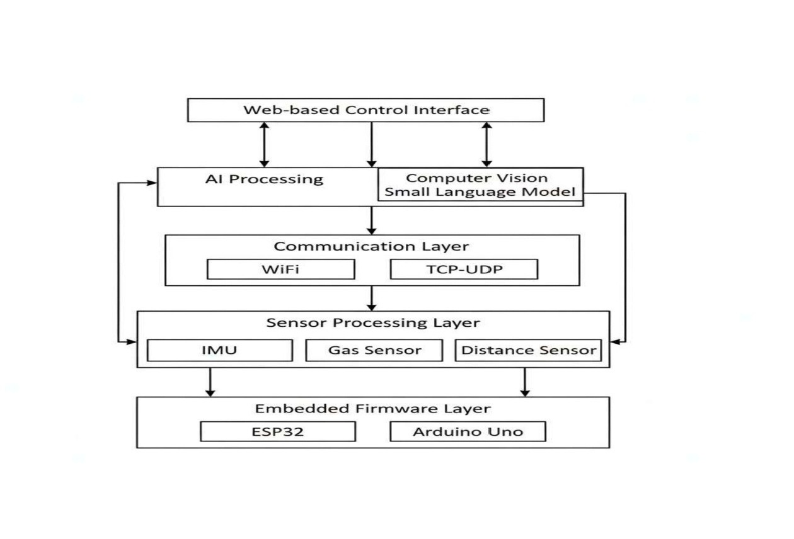

# Intelligent Hexapod Robot 🤖

### AI-Powered Autonomous Robot using YOLOv5 + Edge AI

---

## Overview

The **Intelligent Hexapod Robot** is a robotics system that combines embedded control with computer vision and AI reasoning.
It uses an ESP32 for motion control and Python-based AI for object detection and decision-making.

---

## Features

* Real-time object detection (YOLOv5)
* IP camera video streaming
* Servo-based hexapod movement (32 channels)
* Object counting and scene analysis
* Edge AI reasoning using SLM (llama.cpp)
* Auto and manual control modes

---

## System Architecture

```
Camera → AI (YOLO + SLM) → Decision → ESP32 → Servo Motors
```

---

## Project Structure

```
src/
 ├── arduino/
 │   └── hexapod.ino
 └── python/
     └── main.py

docs/
hardware/
images/
requirements.txt
README.md
```

---

## Installation

### Install Dependencies

```
pip install -r requirements.txt
```

---

## Run the Project

### 1. Upload Arduino Code

Upload `hexapod.ino` using Arduino IDE

### 2. Run Python AI

```
python src/python/main.py
```

---

## Controls

| Key | Action          |
| --- | --------------- |
| A   | Auto Mode       |
| M   | Manual Mode     |
| S   | Send AI Command |
| X   | Stop Robot      |
| Q   | Quit            |

---

## Example Output

```
Detected: 1 person, 2 chairs
AI: Environment is safe. No obstacles nearby.
```

---

## Important Notes

* Do not upload `.onnx` or `.gguf` model files
* Update model paths in code before running
* Ensure ESP32 and PC are on same network

---

## Future Work

* Web dashboard
* Voice control
* Autonomous navigation
* Mobile app integration

---

## Author

Kirana Robotics AI

---

## License

MIT License


## 📸 Project Preview

<p align="center">
  
</p>

## ⚙️ System Architecture

<p align="center">
  
</p>

## 🎥 Demo Video

[▶ Watch Demo](demo.mp4)
[▶ Watch Demo](demo1.mp4)
